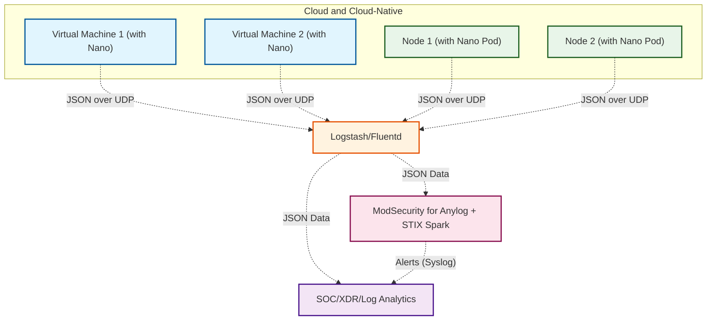

# How to effectively deal with lateral movement attacks?

**Leo Young, 12/04/2024** 

Undoubtedly, lateral movement attacks are the most prevalent attack methods in production environments, yet the current methods all have significant flaws.

- **EDR/HIDS:**  They belong to the principle of host-level security baseline detection and are not targeted at lateral attacks on various networks and applications;
- **Log analysis/SOC:**  The real-time performance is insufficient, coupled with a lack of network logs, and business logs are often severely heterogeneous and incomplete;
- **API security gateway:**  The biggest drawback is that its deployment location determines that it has many detection blind spots, making it unable to form comprehensive detection capabilities;

So, how does Nano achieve high-quality detection of the risk of lateral movement attacks?

The principle is straightforward. As illustrated in the figure below, we will discover this simple yet highly effective approach that can effectively counteract most horizontal movement attacks. Furthermore, the entire approach truly achieves non-intrusive, no blind spots, global coverage, real-time performance, and possesses traceability and analysis capabilities. It represents a scene innovation with immense commercial value.

------

**microflow.io**

leoyoung@microflow.io
